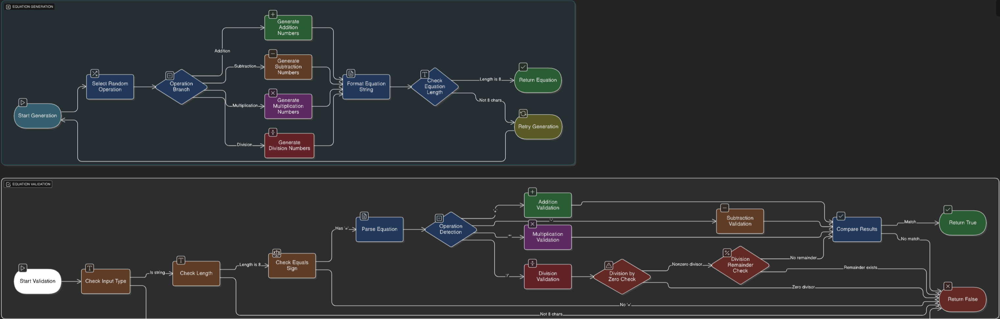

# Nerdle 

The **Nerdle** is an interactive program where users can take a shot at playing a guessing game 

---

## Features  
- A interactive game
- Simple, text-based interface  
- Educational tool for learning 

---

## Installation  

1. Clone the repository:  
   ```bash
   git clone https://github.com/WTCSC/nerdle-Eclipse0-Gum.git
   cd nerdle-Eclipse0-Gum


### Equation Generator 



### Game Engine:
